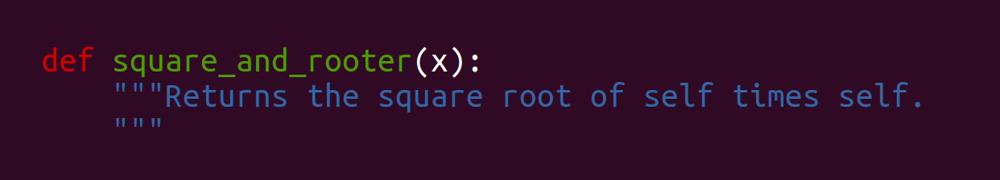

================================================================================
Software design, Packaging and Testing
================================================================================

---------

Software design
===================

Software design is the process by which an agent creates a specification of a
software artifact, intended to accomplish goals, using a set of primitive
components and subject to constraints. Software design may refer to either
"all the activities involved in conceptualizing, framing, implementing,
commissioning, and ultimately modifying complex systems" or "the activity
following requirements specification and before programming, as ... [in] a
stylized software engineering process."

Software design usually involves **problem solving** and **planning a software
solution**.

----

Software design in short
==========================

.. raw:: html

   

How to write good and maintainable code?

.. raw:: html

   

-------

How to write good code ?
=========================

.. image:: images/good_code.png
  :width: 320px

-----

The Tunnel vision
===================

A good designer should consider **alternative approaches**, judging each based
on the requirements of the problem, the resources available to do the job.

- Choose carefully the skills needed to contribute to the project: the
  intersection of people knowlegeable both in C++ and convex optimization is
  fairly small;
- Balance between complexity and functionnality gain;
- Delimitate the project goals;

-----

Don't reinvent the wheel
========================

.. raw:: html

   

Time is short, and resources are limited!

.. raw:: html

   

---------

Quality, Uniformity and integration
====================================

The goal is to add value to your personal code:

- documentation, examples;
- efficiency, generality of the code;
- tests: code base easily modifiable by anyone;
- Code style convention (pep8 for Python);

-----

Modularity
============

The resulting software comprises well defined, independent components. Better
maintainability.

- Implementation and tests in separate modules.
- Division of work between the team.
- Ease of reusability

-----

Reviews
=========

- Avoids flaws in the major conceptual elements of the design:

  - omissions
  - ambiguity
  - inconsistency

-----

An example: the loft
====================

-----

Packaging
==============

-----

Why ?
========

- Distribute your code to others
- Make your code installable in the usual manner most Python developers would
  expect
- Standard Python Package are cross- platform (Windows, OSX, Linux...)
- It organizes your code in a standard way.

------

Typical Project Layout
======================

.. image:: images/typical_project_layout.png
   :width: 520px

-----

Exercise
===========

- Clone the exercise repository:

  ``git clone https://github.com/NelleV/SCExercises``

- See ``exercises/packaging_01.rst``.

-----

A Sample Setup.py
======================

.. image:: examples/sample_setup.png
   :width: 520px

.. XXX REDO

-----

Exercise
===========

See ``exercises/packaging_02.rst``.

-----

And now
========

- Installing : ``python setup.py install``
- Uninstalling :

  - ``pip remove scbctesting``
  - ``rm -rf /usr/local/lib/python2.7/site-packages/scbctesting/``

-----

Creating the package
====================

- ``python setup.py sdist``
- ``python setup.py sdist --formats=gztar,zip``

But it is best to create a Manifest template file first.

-------

Exercise
===========

See ``exercises/packaging_03.rst``

-----

To learn more on distutils
===========================

 http://docs.python.org/2/distutils/index.html

-----

Testing
==============

-----

Outline
================================================================================

  - What is a test?
  - Why testing?
  - Where to put the tests and run them?
  - When should I test?
  - How to write, run and maintain test?

-----

What is a test?
================================================================================

-----

Why testing?
================================================================================

  - To validate code behavior (meet expectations) for many input cases
  - To find bugs earlier when easy to fix
  - To prevent silent regressions when refactoring
  - To guide the development (TDD)
  - To keep the developers motivated

.. FIXME insert code quality in research.

----

Types of Tests
================================================================================

  - **unit tests**: one function / class at a time
  - **integration tests**: many assembly
  - **non-regression tests**:

    - find a bug: write a test to reproduce and
      then fix the bug
    - can be unit tests or integration tests

--------

Where to put the tests?
================================================================================

Put the code in a module (a Python file)::

  mypackage/__init__.py
  mypackage/mymodule.py

Put the tests in a side module, for instance::

  mypackage/test_mymodule.py

---------

How to run the tests (with nose)
================================================================================

Installing nose::

  $ pip install nose
  Downloading/unpacking nose
  Downloading nose-1.3.0.tar.gz (404kB): 404kB downloaded
  ...
  Successfully installed nose
  Cleaning up...

Running nose::

  $ nosetests mypackage
  .

--------

When should I write & run tests?
===================================

  - As early as possible (TDD)
  - As often as possible
  - Before every git push to a public repo
  - Before fixing a bug (non-regression)
  - Tests should be fast to run!

---------

Exercises
================================================================================

See ``exercises/testing_01.rst``.

-----

nose.tools assertions
================================================================================

• The Python assert builtin does not yield very useful error message
• Better nose.tools.assert_*

  - assert_equals(a, b)
  - assert_true(x) / assert_false(y)
  - assert_in(item, sequence)

----

Test Corner Cases
================================================================================

- How should that function react when passed: None, zero or negative numbers,
  empty strings, empty files, NaN inputs...?
- Test the type of exceptions raised in case
  of invalid input:

  - Wrong type should raise TypeError
  - Invalid type should raise ValueError

----

Testing Exceptions
================================================================================

.. image:: examples/testing_exceptions.png

----

Exercises
================================================================================

See ``exercises/testing_02.rst`` and ``exercises/testing_03.rst``.

------

Checking the test coverage
================================================================================

To check the coverage:

- First, install coverage:

    ``pip install coverage``

- Then type:

    ``nosetests --with-coverage mypackage``

----

Documentation
===============

-----

User documentation
===================

- Usually written in Restructured Text, with Sphinx.
- Placed at the root of the project, in a ``doc`` folder.
- Might include:

  - An introduction (very short overview of the project);
  - A tutorial;
  - An API reference, generated from its docstrings;
  - Developer documentation, for potential contributors;

----

Code documentation advices
==============================

- Comments in Python start with a ``#``
- Docstrings are placed at the beginning of the function, between triple
  quotes.

**Do not use triple quotes to comment section of code!!**

----

Numpy doc
=================

- Specific conventions for scientific code: imports, sections, etc
- Sphinx plugin for better integration

See
``https://github.com/numpy/numpy/blob/master/doc/HOWTO_DOCUMENT.rst.txt``

----

Thanks
===========
