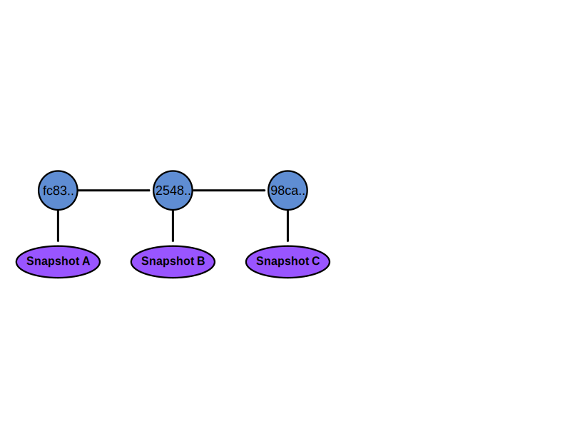
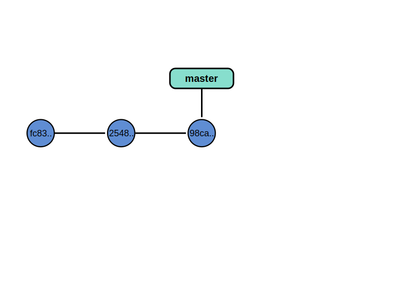
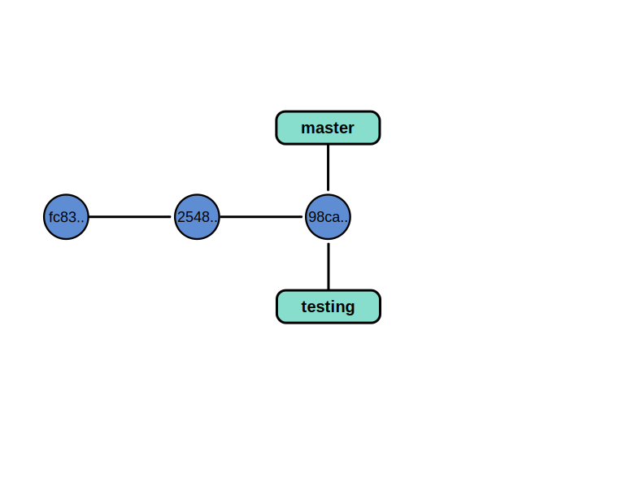
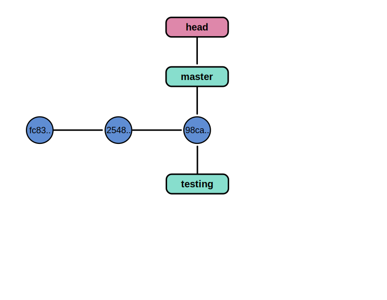
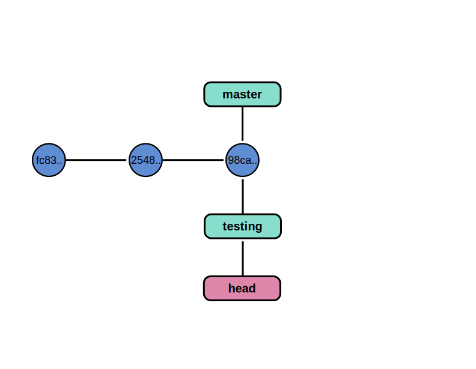
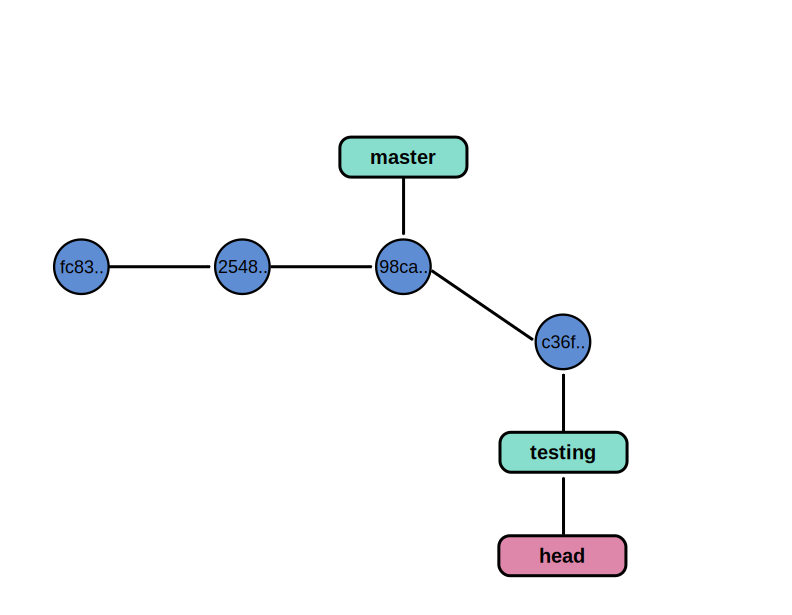
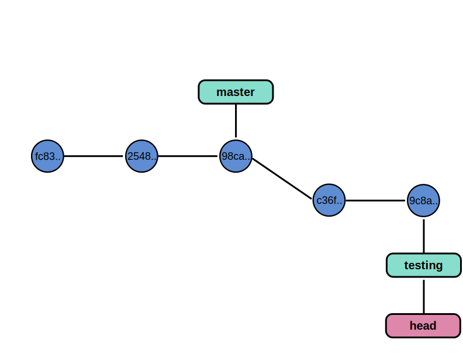
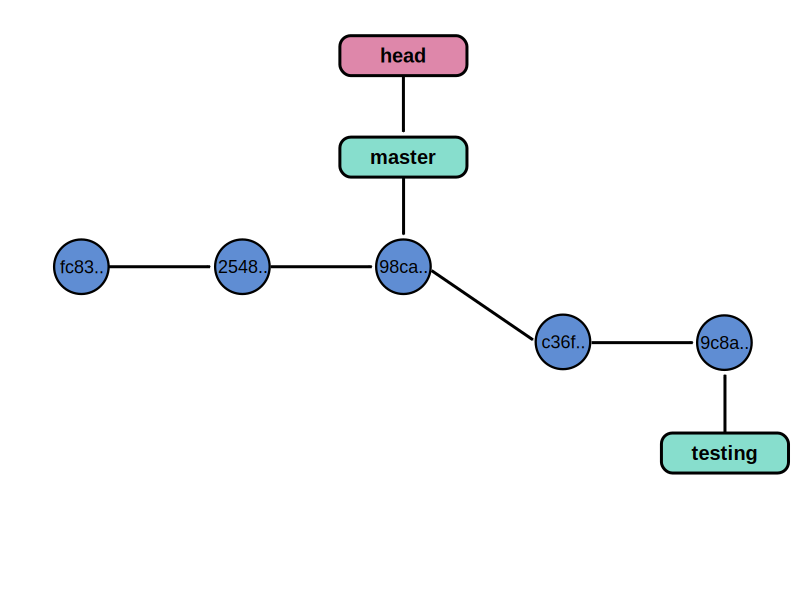
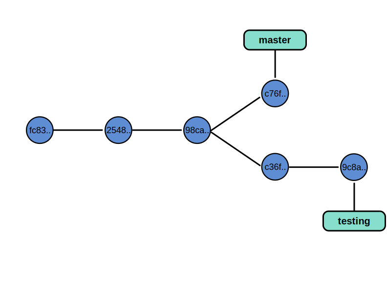

An introduction to Git
================================================================================

----

Why do I need version control ?
================================================================================

As researchers, you want:

- reproducible research
- fast and efficient research

------

A story told by filenames
================================================================================

.. image:: images/version_control.gif

----

Version control
================================================================================

Version control system:

- keeps all the historical versions for easy tracking.
- benefits team collaboration.
- improves our efficiency.
- can be used as a data center, which makes build automation possible.

----

Creating a project
================================================================================

- Initializing a new project::
    ``$ git init``

    ``Initialized empty Git repository in /home/nelle/Projets/SCBC/git-test/.git/``

- Initializing from an existing project::
    ``$ git clone git://github.com/schacon/grit.git``

----

Configuring Git
================================================================================

.. TODO

- **Locally**: only the git repository you are working on will be affected::
    ``git config [options]``

- **User-wide**: the user's default configuration will be modified in ``~/.git/config``::
    ``git config --global [options]``

- **Globally**: system-wide configuration: all users are going to be affected::
    ``git config --system [options]``

----

Configuring git
================================================================================

- Your identity::
    ``$ git config --global user.name "Your Name Comes Here"``
    ``$ git config --global user.email you@yourdomain.example.com``

- Setting your editor::
    ``$ git config --global core.editor emacs``

- Checking your settings::
    ``$ git config --list``

----

Exercise
================================================================================

- Clone the repository: ``git://github.com/NelleV/SCBC-data.git``
- Configure your git environment:
    - ``git config user.name "Your Name Comes Here"``
    - ``git config user.email you@yourdomain.example.com``
    - ``git config color.all auto``
- Check your configuration settings by using ``git config --list``

----

Working alone
================================================================================

----

Saving a snapshot
================================================================================

- Tracked files: files that were in the last snapshots. They can be in 3
  different states:

  - unmodified
  - modified
  - staged

- Untracked files: all the other files

----

File status lifecycle
================================================================================

.. image:: images/git_file_status_lifecycle.png

--------

Commands
===================

- ``git add``: adds a file to the staging area::
    ``$ git add README``

- ``git commit``: commits a file::
    ``$ git commit -m "My commit message"``

- ``git status``: show the status of the files of the repository

- ``git log``: Show commit log

----

Exercices
================================================================================

- Create a new file ``AUTHORS`` and add it to the staging area
- Check what the status of your repository is, by using ``git status``.
- Commit the AUTHORS file
- Now edit the TODO file, and check the status of the repository.
- Add this file to the staging area and commit it
- Type ``git log`` in the repository. What do you see?
- Now, edit the ``README`` file, and add it to the staging area, then edit it
  again, and check the status of the file. What do you see ?
- Commit all your changes.

----

Deleting and moving files
================================================================================

- ``git rm``: Removes files from the working tree::
      ``git rm FILENAME``

- ``git mv``: Move or rename a file or a directory::
      ``git mv FILENAME TARGET``

----

Canceling operations
================================================================================

- ``git reset HEAD``: unstages filename::
    ``git reset HEAD filename``

- ``git checkout``: unmodifies an unstaged file
    ``git checkout -- filenames``

----

Exercises
================================================================================

----

Commits are repository snapshots.
================================================================================

----

A branch is a pointer to a commit.
================================================================================

----

So we can have many branches !
================================================================================

----

But how to know in which branch we are ?
================================================================================

----

We can switch branches.
================================================================================

----

And commit in a branch.
================================================================================

----

Again...
================================================================================

----

And switch branches
================================================================================

----

The code can diverge.
================================================================================

----

Exercises

-----

Remotes
================================================================================

Remote repositories are versions of your project that are hosted on the
Internet or network somewhere.

- ``git remote`` lists the remote servers you have configured.
  Tip: For more verbosity, add ``-v`` option.

- ``git remote add name url``: adds the url as a remote
- ``git remote rm name``: remove the remote ``name``

----

Github
================================================================================

.. image:: images/github.png

----

Exercises
================================================================================

- create a Github account
- upload your ssh key on it
    - to create an ssh-key on unix-based system: ``ssh-keygen -t dsa``
    - to create an ssh-key on windows-based system: follow the information
      `here <http://kb.siteground.com/article/How_to_generate_an_SSH_key_on_Windows_using_PuTTY.html>`_
- Create a repository named ``SCBC``
- Add this repository as a remote

----

Updating a repository
================================================================================

- ``git fetch [remote-name]``: fetches the branches on the remote. The branches
  from that remote are then accessible locally in
  ``[remote-name/branch-name]``
- ``git push [remote-name] [branch-name]``: pushed ``[branch-name]`` onto
  remote ``[branch-name]``
- ``git merge [branch-name]``: merges ``[branch-name]`` into the current
  branch

----

Exercices

-----

Setting up a git repository on a server
================================================================================

