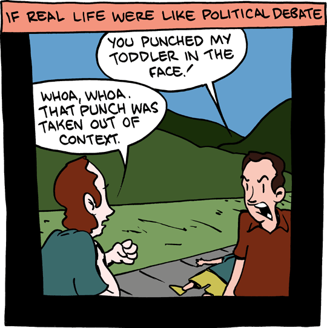

A Quick Guide to Organizing Computational (Biology) Projects
================================================================================

----

In Short ...
--------------------------------------------------------------------------------

.. raw:: html

  

- Poor organizational choices lead to significantly slower research progress.
- It is critical to make your results reproducable.

.. raw:: html

   

----

The Stolen Briefcase
--------------------------------------------------------------------------------

  "Once, several years ago, at a conference, one of us had a briefcase stolen.
  The briefcase contained originals figure which had been developped while an
  employee of a large commercial seismic exploration outfit. [..] A manuscript
  had already been written. The figures were so convincing and pivotal [..] that
  without them, the manuscript made no sense. **The manuscript had to be
  abandonned.**"

----

Who's one First?
--------------------------------------------------------------------------------

  "A Graduate Student comes into a Professor's office and says, "That idea you
  told me to try - it doesn't work!". [..] Unfortunately, the **Student's
  descriptions of the problems he is facing don't give the Professor much
  insight on what's going on.**"

----

A year is time long in this business
--------------------------------------------------------------------------------

  "When he went back to the old software library [..], **he couldn't remember
  how the software worked** - invocation of sequences, data structures, etc. in
  the end, he abandonned the project, saying he just didn't have time to get
  into it anymore."

----

A la recherche des paramètres perdues
--------------------------------------------------------------------------------

  "Well, actually, the reason we didn't give many details in the paper is that
  we forgot which parameters gave the nice pictures you see in the published
  article; when we tried to reconstruct that figure using parameters that we
  thought had been used, we only got ugly looking results. So we knew there
  had been some parameter settings which worked well, and perhaps on day we
  would stumble on them again; but we thought it best to leave things vague"

(note: this story is actually a composite of two separate true incidents)

----

Principles
--------------------------------------------------

----

First Principle
--------------------------------------------------------------------------------

.. raw:: html

     <blockquote class="medium">

"Someone unfamiliar with your project should be able to look at your
computer files and understand in detail what you did and why."

.. raw:: html

     </blockquote>

----

Second Principle
-------------------------------------------------------------------------------

.. raw:: html

     <blockquote class="medium">

"Everything you do, you will have to do over and over again"

.. raw:: html

     </blockquote>

-- Murphy's law

----

File and directory  organization
---------------------------------

----

So far, so good...
--------------------------------------------------------------------------------

----

Now what ?
--------------------------------------------------------------------------------

----

I guess this is alright
--------------------------------------------------------------------------------

----

Which one is the most recent?
--------------------------------------------------------------------------------

----

Another (bad) common approach
--------------------------------------------------------------------------------

----

A (possible) solution
--------------------------------------------------------------------------------

----

Still missing something...
--------------------------------------------------------------------------------

- We give the project to a collaborator
- A new student joins the project
- 3 years later, haven't we forgotten the details of the projects?

We need **context**. We need **metadata**.

----

Metadata
--------------------------------------------------------------------------------

- who is the data from?
- when was it generate?
- what were the experiment conditions?

----

Project organisation
--------------------------------------------------------------------------------

----

The lab notebook
--------------------------------------------------

----

What is it?
--------------------------------------------------------------------------------

  "A laboratory notebook (colloq. lab notebook) is a primary record of research.
  Researchers use a lab notebook to document their hypotheses, experiments and
  initial analysis or interpretation of these experiments. The notebook serves
  as an organizational tool, a memory aid, and can also have a role in
  protecting any intellectual property that comes from the research."

      -- Wikipedia

----

The notebook
--------------------------------------------------------------------------------

- entries should be dated
- verbose, links or embedded images, tables
- results of all the experiments performed

----

Carrying out a Single Experiment
--------------------------------------------------

----

Experiments
------------

- record all operations you do, in order to make those operations transparents
  and reproducable.
- in practice, create a README, in which you store every command line you use

----

6 steps
---------

- Record every operation you perform
- Comment generously
- Avoid editing intermediate files by hand
- Store all files and directory names in the script
- Use relative pathnames to access files within the same project
- Make the script restartable

----

Handling and preventing errors
--------------------------------------------------

----

Bugs...
--------------------------------------------------------------------------------

.. raw:: html

  

You **will** introduce errors into your code

.. raw:: html

   

.. image:: ./images/bug.png

-----

3 suggestions for error handling
--------------------------------------------------------------------------------

- Write robust code to detect errors
- When an error occurs abort
- Whenever possible, create an output file using a temporary name, and rename
  the file when the script is complete

----

Command line vs script vs program
--------------------------------------------------

----

Software engineering
--------------------------------------------------------------------------------

.. image:: ./images/good_code.png
   :scale: 70%

----

4 types of script
--------------------------------------------------------------------------------

- Driver script:
- Single use script: data format conversion
- Project specific script: contains a generic functionality used by multiple
  experiments
- Multi projects script: functionnalities used across many projects (ROC
  curve, n-fold cross validation, etc).

----

The Value of Version Control
--------------------------------------------------------------------------------

----

----

Thanks for your attention
--------------------------------------------------------------------------------
